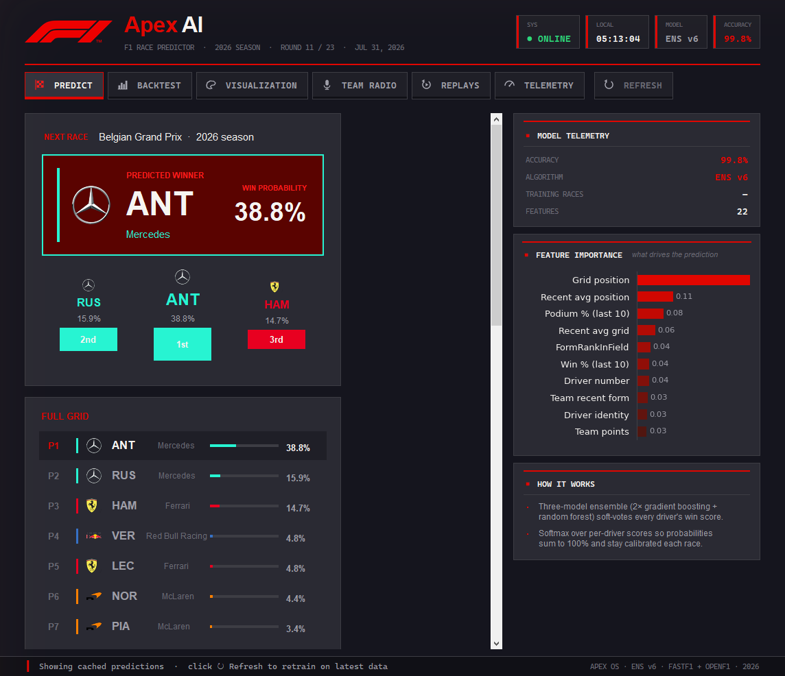
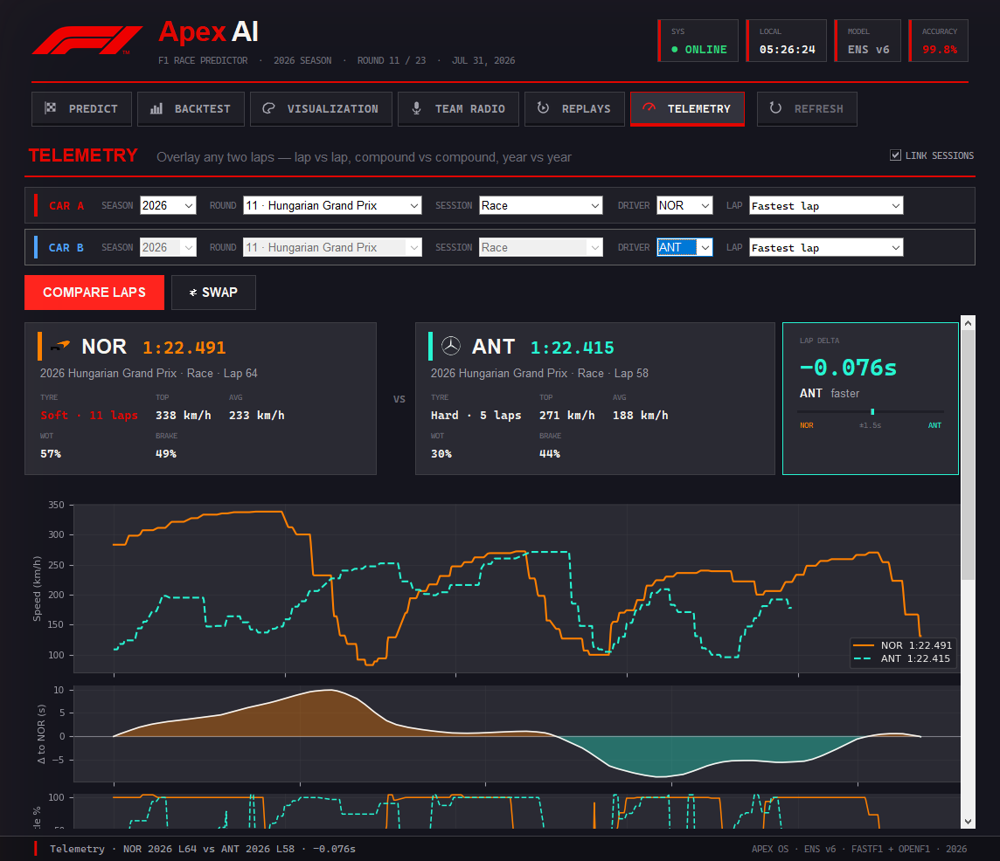

# ApexAI — F1 Race Predictor

ApexAI is an end-to-end Formula 1 race prediction *and telemetry* suite.
It ingests timing data with
[FastF1](https://github.com/theOehrly/Fast-F1), trains a three-model
soft-voting ensemble on five seasons of race history (2022 – 2026
mid-season), and presents calibrated win probabilities for the next race
inside a custom Tk + PIL desktop app styled like a pit-wall racing
console — complete with a broadcast-style podium, per-circuit ambient
theming, live FIA team-radio playback, one-click race replays for every
session of every round, a lap-vs-lap telemetry overlay, and a fully
scrubbable data-driven replay of any session since 2018.



*The Predict tab: podium, full grid with calibrated win probabilities,
and the feature importances behind the pick.*



*The Telemetry tab: two laps of the 2026 Hungarian Grand Prix on a
shared axis. The closing delta (−0.076 s) is exactly the gap between the
two lap times — see the alignment notes below.*

> Looking for the full product spec? See [`docs/PRD.md`](docs/PRD.md).

## Highlights

- **Three-model soft-voting ensemble** (`prediction.py`, model v6) —
  a classic Gradient Boosting Classifier, a HistGradientBoosting model
  (leaf-wise trees + L2 regularisation), and a Random Forest vote on
  every driver's win score with 2:2:1 weights. The members disagree
  exactly on the marginal races where a single model's variance flips
  the pick, so the average beats any individual member on walk-forward
  accuracy. Raw scores are softmax-calibrated with a temperature term
  so the grid sums to 100 % and no driver collapses to a 0 % outlier.
- **Ablation-validated features** — every candidate feature is accepted
  or rejected by a leak-free walk-forward benchmark over all 32
  completed 2025 – 2026 races. The v6 winner: a within-race *form rank*
  (is this the best recent form **on this grid**, not just "good
  form"), which lifted top-1 accuracy from 53 % to 56 % on 2025 – 2026.
  Candidates that hurt accuracy (points shares, 3-race momentum,
  quali-surprise) are computed in the dataset but deliberately kept
  out of the model input.
- **Validated on the 2026 season** — in the same walk-forward backtest
  (train only on races before each round, predict that round) the model
  picks the actual winner in 6 of the 8 completed 2026 rounds
  (75 % top-1) and has the winner inside its top 3 for all 8
  (100 % top-3).
- **Rich feature engineering** — season-to-date championship standings
  (driver + team, leak-free), career points, rolling win/podium rates,
  average finish, grid→finish racecraft delta, within-race form rank,
  head-to-head vs teammate, DNF rate, driver experience, circuit
  affinity, and team / power-unit form, all derived on the fly from
  FastF1 results.
- **Recency-weighted training** — training rows decay at `0.85^age` per
  season, so races run under the 2026 regulations (50/50 hybrid power
  split, new aero, Cadillac + Audi) dominate the fit while older
  ground-effect seasons still contribute signal.
- **Fast leave-one-race-out backtest** — the full 2022 → 2026 backtest
  (~100 races) runs each race as a single fixed-configuration ensemble
  fit (no per-race hyperparameter search) and parallelises the outer
  race loop with `joblib`, finishing in a few minutes on a multi-core
  machine instead of the better part of an hour. Predictions stay warm
  during and after the backtest, so you can flip straight to
  Visualization or Replays.
- **2026 mid-season build** — driver lineup, team roster, and the new
  Cadillac and Audi power units are all wired in. The training pipeline
  automatically re-fetches if `data.csv` is missing rounds from the
  latest completed weekend.
- **Racing-console GUI** (`app.py`) — Tk + PIL interface styled like a
  steering-wheel / pit-wall console: a telemetry header cluster with a
  pulsing SYS LED, live session clock, and model/accuracy readouts; six
  console-button tabs (*Predict*, *Backtest*, *Visualization*,
  *Team Radio*, *Replays*, *Telemetry*) with red engaged
  light-bars; monospace telemetry fonts throughout; a carbon-fiber cap
  strip; and a timing-bar footer — plus a one-click *Refresh* to
  retrain on the latest data.
  - **Each tab leads with its own glyph** — a chequered flag for the
    pick, bars for the backtest, a circuit silhouette for the map, a
    microphone for radio, a replay loop for the replays hub, a
    speedometer for telemetry. They are drawn procedurally with PIL
    rather than shipped as image files, so the engaged state is just a
    re-tint of the same path and they stay sharp at any size (each is
    painted at 4× and downsampled). A Pillow-less install falls back to
    the original numbered keys rather than to bare words.
  - **Home button:** the F1 logo + "ApexAI" wordmark in the header
    return you to the last predicted race from anywhere in the app.
  - **30 fps animated track-map visualisation** with per-driver dots,
    automatic MOM (Maximum Overtake Moment) zone detection on the
    longest straights, hand-traced real circuit silhouettes, and a
    podium card featuring procedural anti-aliased gold / silver /
    bronze trophies plus a laurel wreath.
  - **Per-race ambient theming:** sakura petals at Suzuka, maple leaves
    at Montréal, Mediterranean sun over Monaco, carnival confetti at
    Interlagos and Mexico City, neon + fireworks on the Vegas Strip,
    rain over Silverstone and Spa, starlit skies over the desert
    circuits, and more.
  - **Singleton enforcement** — launching `app.py` while another
    instance is open kills the prior PID (with `SIGKILL` fallback) and
    sweeps the OS process list so stale instances from terminals or
    IDE runs are also reaped. Exactly one bot instance ever runs.
  - **Prediction + model caching** (`model_cache.pkl`,
    `last_predictions.pkl`) is stamped with a `MODEL_VERSION` so a
    relaunch on a bumped model rebuilds automatically and a relaunch
    on the same version is instantaneous.
  - **Nothing heavy on the launch path** — the console paints from the
    prediction cache (plain data, ~8 KB) while the expensive pieces load
    on demand: the 6 MB fitted ensemble is unpickled on the first click
    that needs it (on a worker thread, behind a *Warming up* status),
    sklearn is imported only inside the functions that build or score a
    model, and `matplotlib.pyplot` only when the first chart is drawn.
    Warm launch to a populated console: **~5 s, down from ~8.5 s**, with
    sklearn never loaded at all unless you ask for something that needs
    it.
- **Full-race team radio** (`radio_fia.py`) — radio clips are fetched
  directly from the FIA livetiming archive (with OpenF1 as a fallback)
  and each clip is mapped to its lap number by matching its capture
  timestamp against the race event log. Plays back through
  `playsound3`.
- **Replays** (*05 Replays*) — one tab, two ways to watch a session
  back, picked with the *LIVE SESSION* / *BROADCAST ARCHIVE* switch
  under the title:
  - **Broadcast archive** — every session of every round, deep-linked to
    [fullraces.com](https://fullraces.com). Pick a season, click *Race* /
    *Qualifying* / *Sprint* / *Sprint Quali* / *Practice* and the
    replay opens in your default browser.
  - **Live session** — the data-driven replay described below.

  The tab reopens on whichever half you used last, and each half is
  built lazily on first view.
- **Telemetry overlay** (`telemetry.py` + *06 Telemetry*) — put any two
  laps side by side on a shared distance axis: speed, throttle, brake,
  DRS and gear traces, a running time delta, and a mini-sector
  dominance map showing exactly where each lap was won. Alignment is by
  *distance around the lap* rather than by clock, so the two laps do not
  have to come from the same session — **lap vs lap**, **compound vs
  compound** and **year vs year** are all the same feature. Turn off
  *LINK SESSIONS* to reach across weekends and seasons.
  - Laps are aligned on **fraction of the lap**, not raw metres. FastF1
    integrates its `Distance` channel from the speed trace, and that
    integration drifts 10 – 15 % between laps of the same circuit, so
    raw metres would line one lap's turn 8 up against the other's turn
    10. Each lap's time axis is also anchored to its official lap time,
    because the car-data slice stops a little short of the timing beam
    by a different amount every lap. Together those two corrections are
    what make the closing delta equal the real gap between the two lap
    times rather than being tens of seconds out.
- **Session replay** (*05 Replays → LIVE SESSION*) — a real, data-driven
  replay of any session from 2018 onwards, rebuilt from FastF1's position
  and car-telemetry streams:
  - **Live track map** traced from the session's own position data, with
    numbered corners and every car moving in real time.
  - **Timing screen** with running order, gap to the leader, current lap,
    tyre compound and rolling personal best. Races are ordered by track
    position (each car projected onto the circuit centreline for a true
    live order); qualifying and practice are ordered by best lap, exactly
    like the real broadcast screens.
  - **Telemetry HUD** for the focused car — speed, gear, throttle/brake
    bars, RPM, DRS and tyre. Click any timing row to follow that driver.
  - **Transport controls** — play/pause, 0.5× → 16× playback, scrub bar,
    and ±1 lap jumps.
  - Built replays are cached to `replay_cache/`, so re-opening a session
    you have already watched is instant.

## Setup

```bash
pip install -r requirements.txt
```

Dependencies (`requirements.txt`): FastF1, pandas, scikit-learn, numpy,
matplotlib, Pillow, `f1radio[playback]`, `playsound3`, `joblib`.

The first launch downloads timing data through the official F1 API and
caches it in `cache/`. If `data.csv` is missing or stale, race results
from 2022 through the most recent completed 2026 round are pulled to
rebuild the training dataset (cold-start can take a few minutes the
first time; subsequent launches hydrate from the cache and are
near-instant).

## Usage

### GUI (recommended)

```bash
python app.py
```

Click **Predict Next Race** to fetch data, train the model, and view
the podium card + win probabilities for the next round. From there:

- **Backtest All Races** — Aggregate accuracy across 2022 – present
  with a per-season breakdown card (~28 s on a multi-core Mac; much
  slower on Windows — see [`docs/PRD.md`](docs/PRD.md) F2.4).
- **Race Visualization** — Animated track map with MOM zones, podium
  trophies, and circuit-specific ambience.
- **Team Radio** — Browse and play back full-race radio clips for any
  driver, lap-mapped from the FIA archive.
- **Replays** — Two modes behind one tab. *LIVE SESSION*: pick a session
  and hit *Load Replay*; the first load downloads its telemetry stream (a
  minute or so on a race), after that it comes straight from
  `replay_cache/`. *BROADCAST ARCHIVE*: one-click links to FullRaces.com
  for every session of every round, by season.
- **Telemetry** — Pick a season, round and session, then a driver and
  lap on each side, and hit *Compare Laps*. Leave *LINK SESSIONS* on to
  compare two drivers in the same session; turn it off to compare across
  sessions or seasons.
- **F1 / ApexAI logo (header)** — Click anywhere on the brand mark to
  jump back to the predictions view.

### Command line

```bash
python predict_winner.py
```

Prints the predicted winner of the most recent race, the upcoming
round, and the model's overall validation accuracy.

## Team logos

To use the official team logos instead of coloured initials badges:

```bash
python fetch_logos.py
```

This downloads up-to-date PNGs (Wikimedia thumbnails, 500 px wide) to
`logos/`. `--force` re-downloads existing files. Logos are auto-cropped
and aspect-preservingly resized at runtime, with icon-only crops used
at small sizes (grid rows, podium) for legibility.

## Project layout

```
app.py            Tk + PIL desktop app (GUI, viz, radio, replays hub,
                  telemetry overlay)
prediction.py     Data ingest, feature engineering, model training,
                  caching, singleton enforcement, and inference
telemetry.py      Telemetry + session-replay data layer: lap traces,
                  distance alignment / delta, and replay frame building
predict_winner.py Headless CLI entry point
radio_fia.py      FIA livetiming archive client for full-race radio
team_colors.py    Official team-colour palette
team_logos.py     Logo loading, icon cropping, alpha-aware resizing
track_layouts.py  Hand-traced silhouettes for every 2026 circuit
fetch_logos.py    Wikimedia logo downloader
docs/PRD.md       Full product requirements document
```

## Building a Mac executable (optional)

```bash
pip install pyinstaller
./build_mac.sh
```

Produces `dist/F1 Winner Predictor.app`. Data and cache live in
`~/Library/Application Support/F1 Winner Predictor/`.

## Data sources

- **Race + timing data** — `fastf1`, talking to the official F1 live
  timing API.
- **Telemetry + session replay** — the same FastF1 feed's car-data and
  position streams (`Speed`, `Throttle`, `Brake`, `nGear`, `RPM`, `DRS`,
  `X`/`Y`). These only exist from 2018 onwards, which is why the
  telemetry and replay season selectors stop there.
- **Team radio** — FIA livetiming archive (`TeamRadio.json` +
  `TeamRadio.jsonStream`) with OpenF1 as a fallback.
- **Race replays** — [fullraces.com](https://fullraces.com), reached
  through deep-linked WordPress search URLs so the integration
  survives post-title changes.

## License

[MIT](LICENSE)
